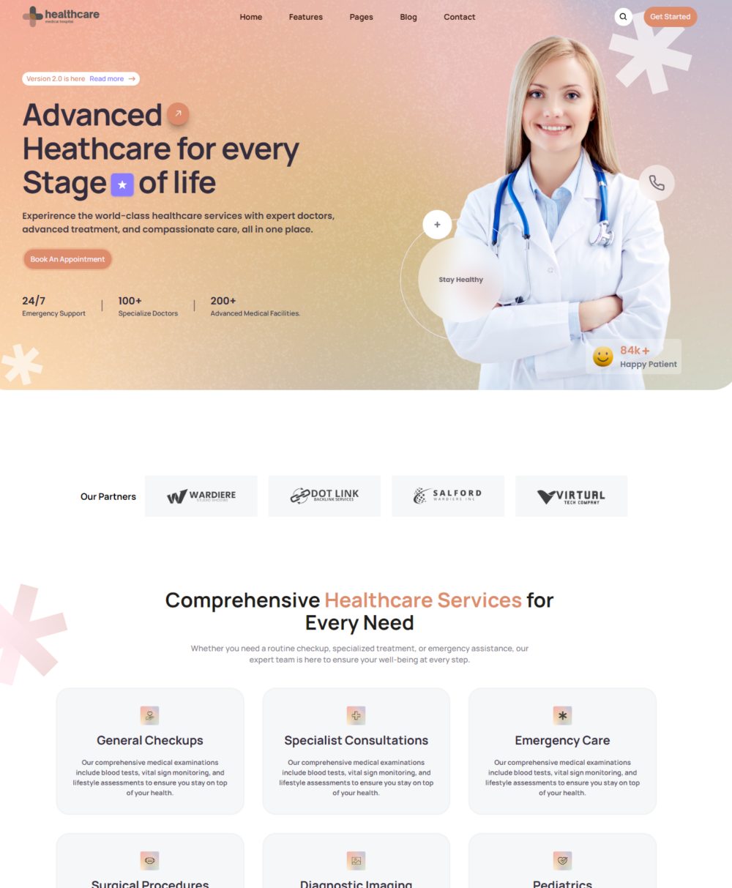

# 🏥 Medical Hospital Website

A modern, responsive, and user-friendly website for a medical hospital. This project aims to provide patients and visitors with essential information, appointment scheduling, and access to healthcare services.

## 📸 Preview



---

## 🚀 Features

- 🏠 Home page with a welcoming hero section

---

## 🛠️ Tech Stack

- **Frontend:** React / JavaScript
- **Styling:** TailwindCSS / CSS Modules
<!-- - **Icons:** React Icons / HeroIcons -->

---

## 🧪 How to Run Locally

```bash
# 1. Clone the repository
git clone https://github.com/Adecid/Medical_hospital_site

# 2. Navigate into the project folder
cd Medical-hospital

# 3. Install dependencies
npm install

# 4. Start the development server
npm run dev